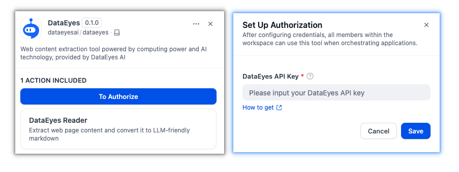
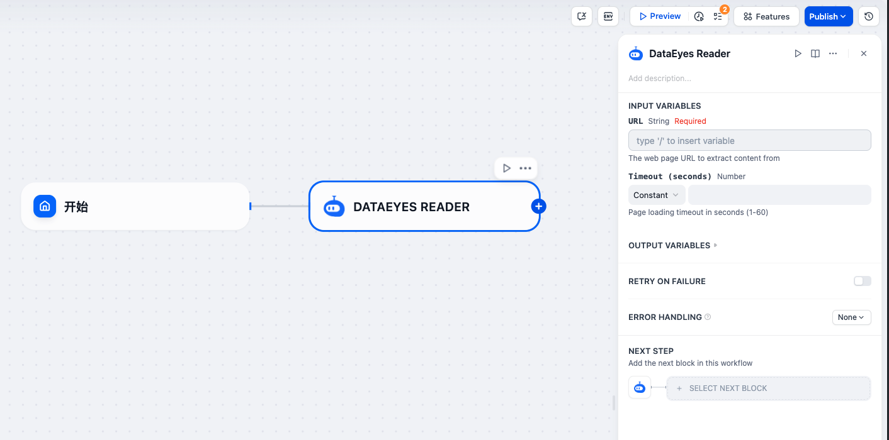
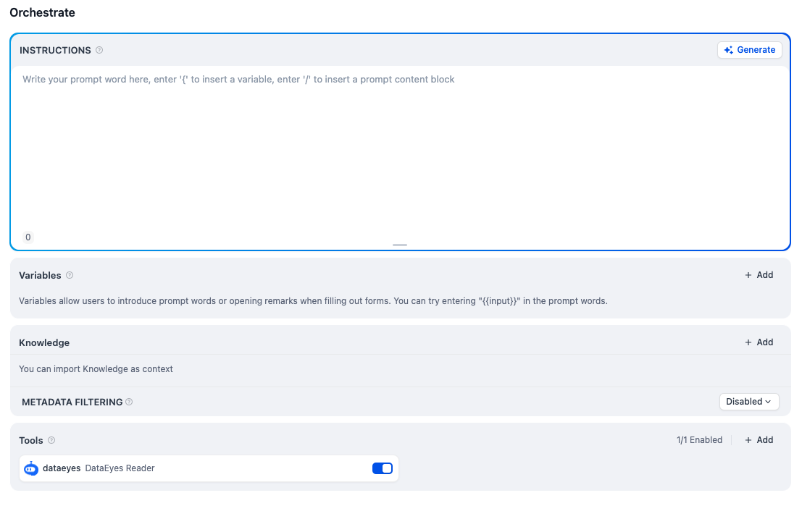

# DataEyes Web Reader

## Overview

DataEyes Web Reader transforms web pages into LLM-friendly markdown content using advanced computing power and AI technology, provided by DataEyes AI. It intelligently extracts and converts web information, making it easily accessible for AI processing and analysis.

## Configuration

### 1. Apply for a DataEyes API Key

Go to the [DataEyes API Keys](https://shuyanai.com) page to create an account and create your API Key.

### 2. Get DataEyes from Plugin Marketplace

The DataEyes plugin can be found in the Plugin Marketplace. Install it to start using web content extraction in your workflows.

### 3. Configure the Plugin in Dify

Navigate to **Plugins > DataEyes** in Dify and input your API Key to authorize the plugin.

## Tool Features

### Web Content Extraction

Extract clean, readable content from any web page URL. The tool processes web pages and returns structured markdown output optimized for AI models.

### Content Processing

- Converts HTML to markdown format
- Removes navigation and sidebar elements
- Preserves main content structure
- Optimized for LLM processing

## Usage

DataEyes integrates with both **Chatflow / Workflow Apps** and **Agent Apps**.

### Chatflow / Workflow Apps

Use DataEyes as a node in your workflow to extract web content for processing.

### Agent Apps

Enable DataEyes as a tool for your AI agent to read and analyze web content automatically.

### Input Parameters

- **URL**: Web page URL to extract content from

### Output

- **Extracted Content**: Clean markdown content from the specified web page

## Use Cases

- Extract article content for analysis
- Convert web pages to markdown format
- Process web information in AI workflows
- Read web content for AI applications
